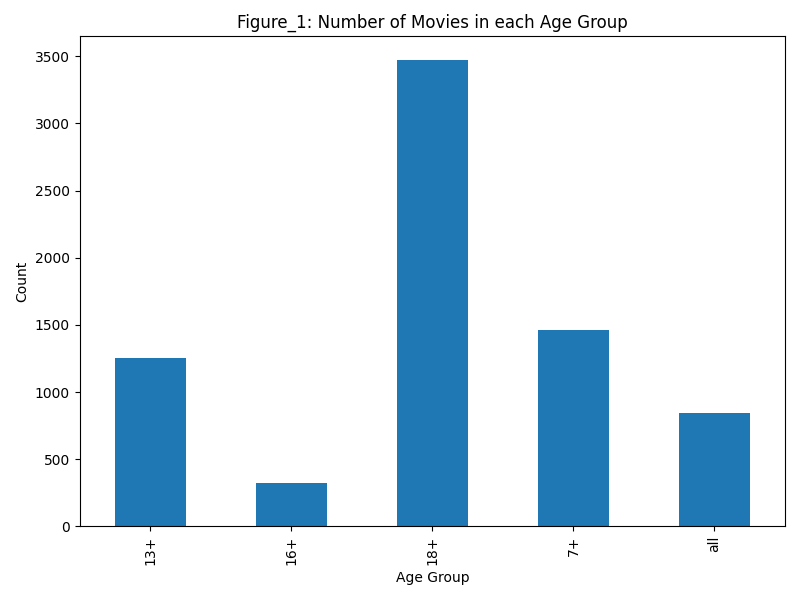
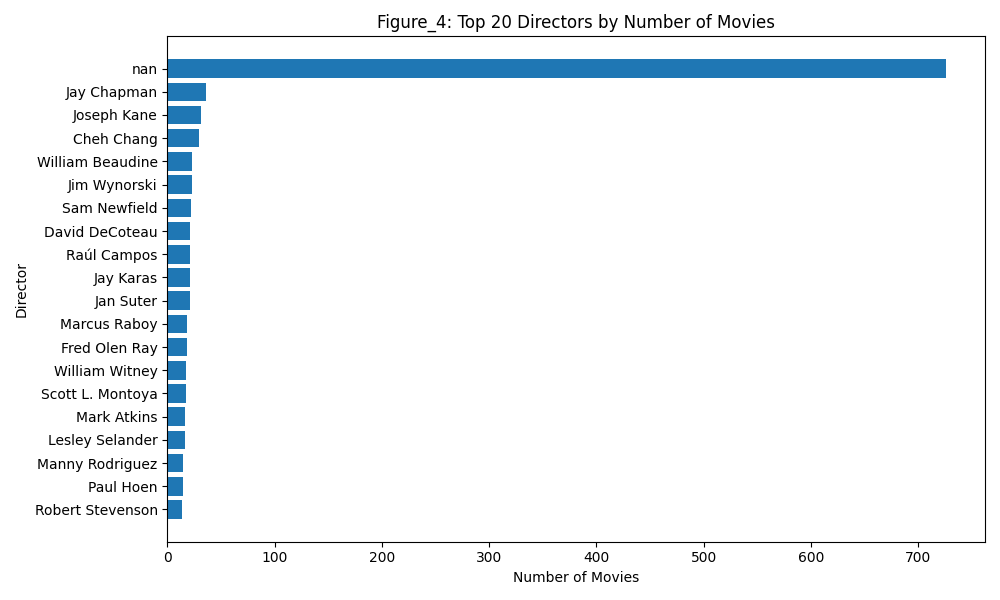
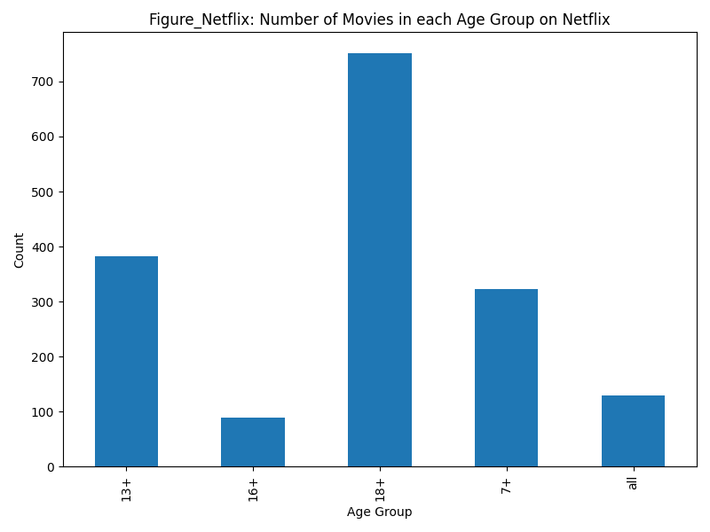
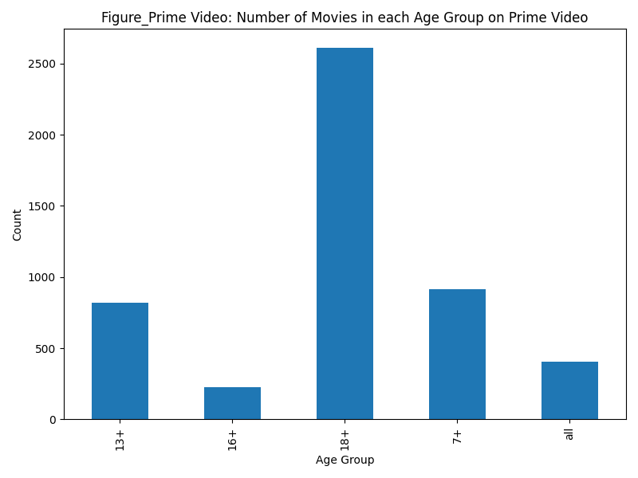
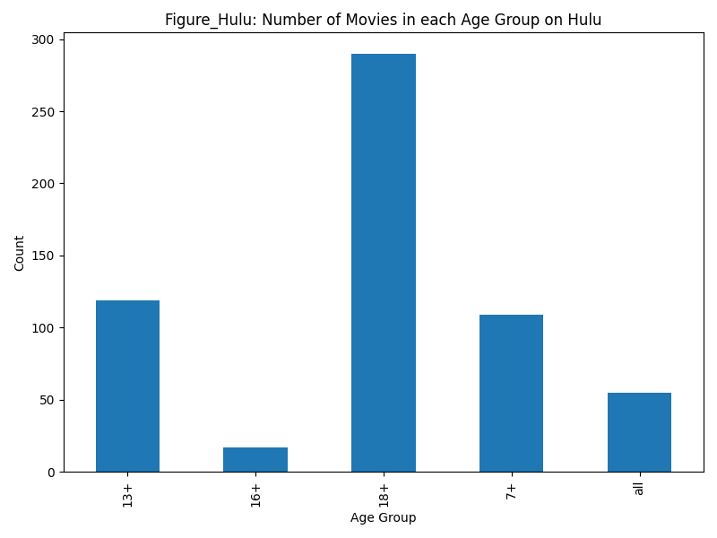
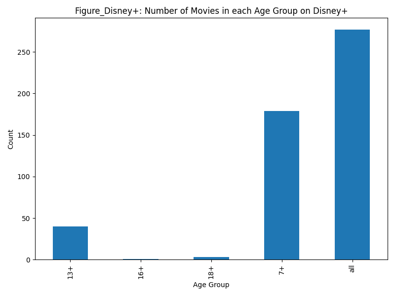
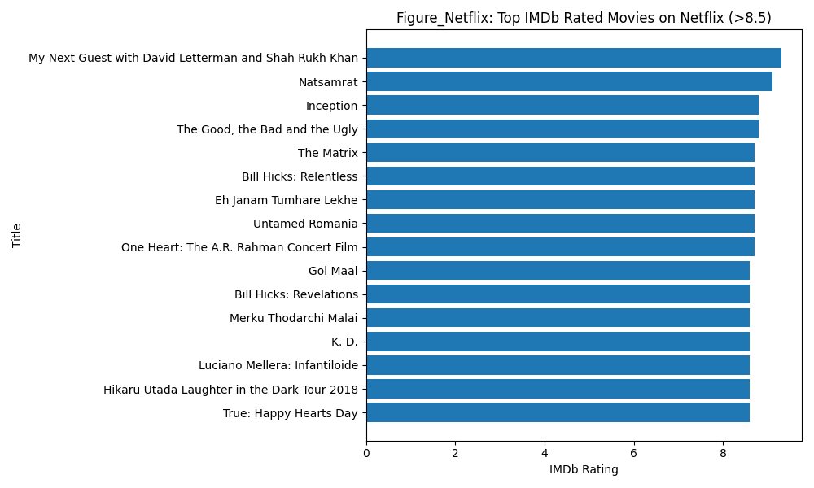
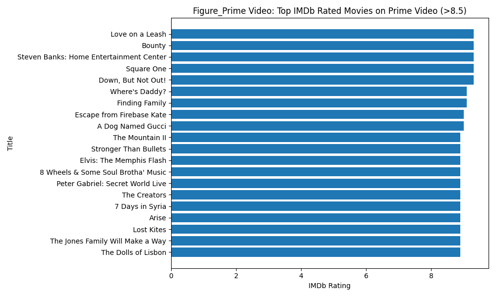
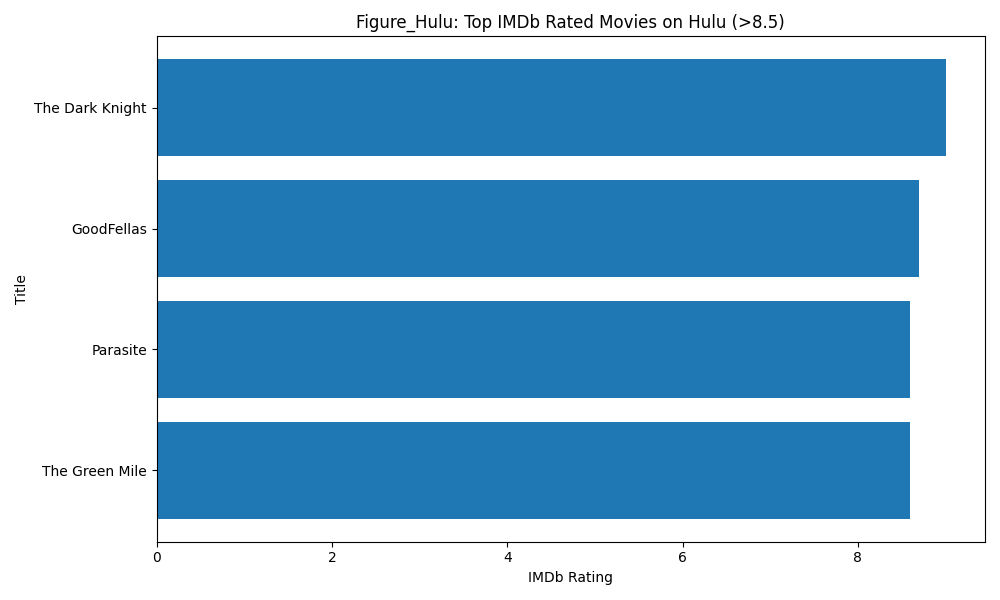

# AI-Driven Streaming Platform Analysis

This project analyzes and compares major streaming platforms (Netflix, Hulu, Prime Video, Disney+) using a dataset of ~16k movies, and applies machine learning to predict IMDb ratings and compute AI-enhanced platform quality scores.

## Objectives

- Explore how content is distributed across platforms by:
  - Age ratings
  - Runtimes
  - Genres
  - Directors
  - Top-rated titles
- Train a machine learning model to predict IMDb ratings from movie metadata.
- Use the model to fill missing IMDb ratings and recompute platform-level quality metrics.

## Dataset

- File: `moviestreams.csv`
- Approx. rows: 16k+
- Key columns:
  - `Title`, `Year`, `Age`, `Runtime`
  - `IMDb`, `Rotten Tomatoes`
  - Platform flags: `Netflix`, `Hulu`, `Prime Video`, `Disney+`
  - `Directors`, `Genres`, `Country`, `Language`

> Note: The dataset is not mine; it is used for educational / analysis purposes.

## Exploratory Data Analysis (EDA)

Implemented in `Project1.py`:

- Global age-rating distribution and per-platform age distributions.
- Top 10 most common runtimes.
- Top 20 directors by number of movies.
- Top 20 genres by frequency.
- Top IMDb-rated movies (IMDb > 8.5) per platform.

Plots are generated using Matplotlib.

## Sample Outputs

### Global Distributions

**Number of movies in each age group (all platforms)**  


**Top 10 most common movie runtimes**  


**Top 20 directors by number of movies**  


**Top 20 genres by count**  


---

### Age Group Distribution per Platform

**Netflix – number of movies in each age group**  


**Prime Video – number of movies in each age group**  


**Hulu – number of movies in each age group**  


**Disney+ – number of movies in each age group**  


---

### Top IMDb-Rated Movies per Platform (IMDb > 8.5)

**Top IMDb-rated movies on Netflix**  


**Top IMDb-rated movies on Prime Video**  


**Top IMDb-rated movies on Hulu**  


**Top IMDb-rated movies on Disney+**  


---

## Machine Learning

### Goal

Predict IMDb rating from movie metadata and use predictions to fill missing ratings.

### Features

- Numerical: `Year`, `Runtime`
- Categorical: `Age`, `Genres`, `Country`, `Language`

### Model & Pipeline

- `scikit-learn` pipeline with:
  - `SimpleImputer` (median for numeric, most_frequent for categorical)
  - `OneHotEncoder` for categorical variables
  - `RandomForestRegressor` as the model
- Train/test split using `train_test_split`.

### Metrics

_(Replace with your actual values from the console if you like)_

- MAE (Mean Absolute Error): **X.XXX**
- RMSE (Root Mean Squared Error): **Y.YYY**
- R² (Coefficient of Determination): **Z.ZZZ**

### AI-Enhanced Platform Comparison

- Use the trained model to predict IMDb for movies with missing ratings.
- Create `IMDb_filled` combining actual and predicted IMDb.
- Compute, per platform:
  - `Num_movies`
  - `Avg_IMDb_original`
  - `Avg_IMDb_filled`
- Plot average IMDb_filled per platform.

**Average IMDb rating per platform (using IMDb_filled)**  


## Tech Stack

- Python
- Pandas, NumPy
- Matplotlib
- scikit-learn
  - `Pipeline`, `ColumnTransformer`
  - `SimpleImputer`, `OneHotEncoder`
  - `RandomForestRegressor`

## How to Run

1. Install dependencies:

   ```bash
   pip install pandas numpy matplotlib scikit-learn

